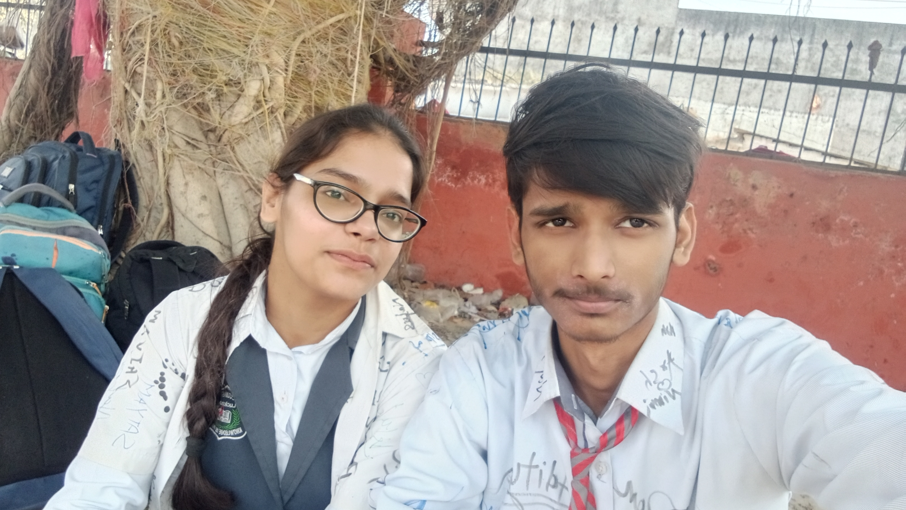
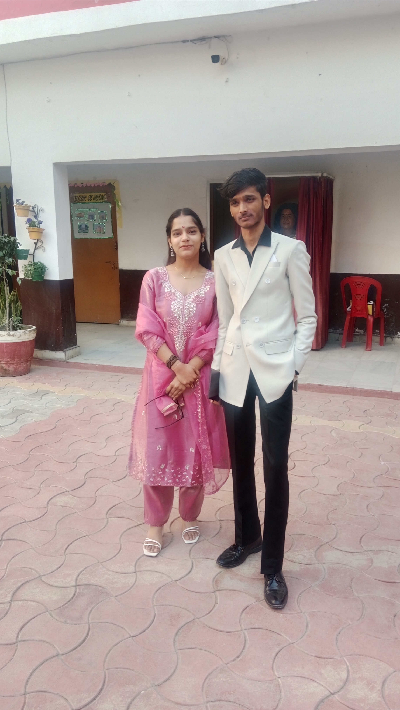
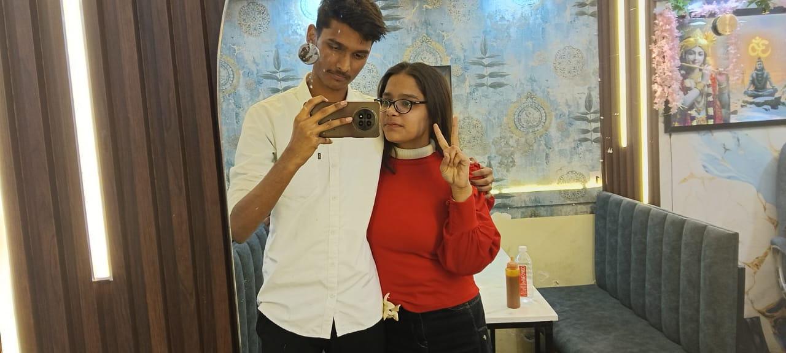
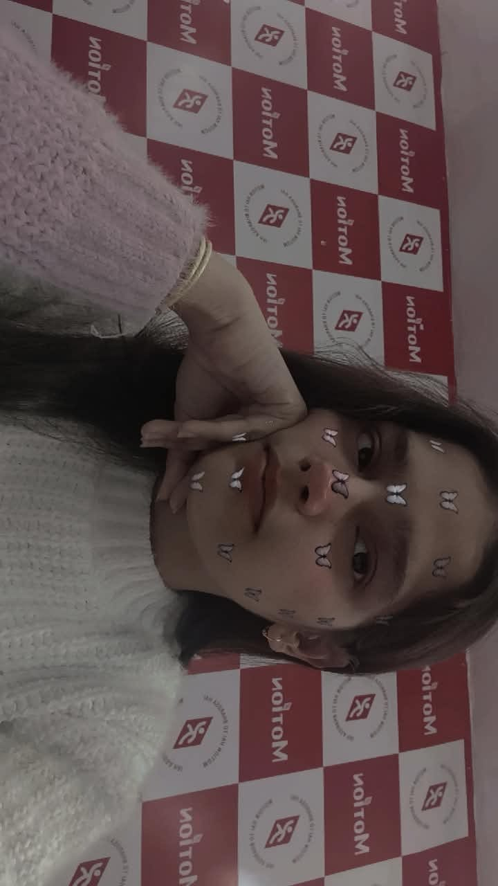

<!DOCTYPE html>
<html lang="en">
<head>
<meta charset="UTF-8">
<meta name="viewport" content="width=device-width, initial-scale=1.0">
<title>Nimmie ❤️</title>

<link href="https://fonts.googleapis.com/css2?family=Playfair+Display:wght@600&family=Poppins:wght@300;400;600&display=swap" rel="stylesheet">

</head>

<body>

<!-- Music -->
<iframe style="display:none"
src="https://www.youtube.com/embed/0xq6cQwZKxw?autoplay=1&loop=1&playlist=0xq6cQwZKxw">
</iframe>

  <h1>Nimmie ❤️</h1>
  
This page exists… because you do.

  <a href="#question" class="btn">Tap gently 🌹</a>

  

    <h2>🌹 Rose Day</h2>
    
If feelings had a color, they’d bloom like this.

  

  

    <h2>🍫 Chocolate Day</h2>
    
Sweet moments are better when shared with you.

  

  

    <h2>🤗 Hug Day</h2>
    
Some comforts don’t need arms — just presence.

  

  

    <h2>❤️ Valentine’s Day</h2>
    

      I don’t promise perfection. 
      I promise honesty, effort, 
      and a heart that chooses you.
    

  

  

    <h2>💌 Nimmie…</h2>
    
<b>Will you be my Valentine?</b>

  

  

    <h2>📸 Us</h2>
    

      
      
      
      
      
      
    

  

  <footer>
    Made with ❤️ by Aleem 
    Feb 14
  </footer>

</body>
</html>
